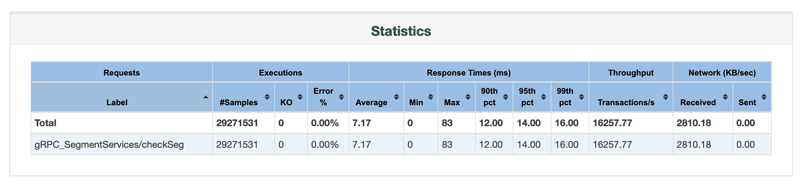

# JMeter gRPC Request

<p align="center"></p>

<h4 align="center">This sampler JMeter lets you send an gRPC request to a server. </br> It's as simple as an HTTP Request.</h4>
<br>

[](https://www.javadoc.io/doc/org.apache.jmeter/ApacheJMeter_core)
[](https://stackoverflow.com/questions/tagged/jmeter)

## What is it

This is a simpler of JMeter used to test for any gRPC server, it is not necessary to generate grpc classes or to compile the protos binary for the service. Just a very simple for input:

- Host and port of gRPC service.
- Method of service needs testing.
- Folder path of proto files.
- Data request in JSON format.

Same as JMeter HTTP Request but for gRPC. Copy only once file jar to lib/ext of JMeter, select your protobuf folder and start making requests! No extra steps.

## Features

- Supports Blocking Unary Calls.
- Parses proto files at runtime.
- Supports plain text connections.
- The request data is in JSON format and can be imported by file.
- Runs on Mac, Linux and build project by Maven.

*Todo:*

- [x] *Supports TLS connections.*
- [ ] *Supports authentication.*

## Usage

<p align="center"></p>

### Requirements

All you need copy *jmeter-grpc-request* file jar to directory `lib/ext` of JMeter and restart JMeter GUI (copy once, use forever). Binary are available from the [dist/bin](./dist/bin/) directory.

### Making a grpc request with JMeter

Create test script:

- Add Thread Group: right-click on the Sample Test (our Test Plan) → Add → Threads (Users) → Thread Group.
- Add Grpc Request: right-click on the newly created Thread Group  → Add → Sampler → Grpc Request.
- Fill info request: host, port, method, data request, proto folder.
- Save test script.

Run test:

- Via JMeter GUI: in top bar click Run → Start.
- Via command line: `bin/jmeter -n -t <test JMX file>.jmx -l <test JMX result>.csv -j <test log file>.log -e -o <Path to output folder>`.

## Running the examples

Example invocations can be found in the [example](./dist/example) directory.

## Benchmark

Purpose verify that *jmeter-grpc-request* is really stable when performing load testing for the gRPC system. Read more [Benchmark: jmter-grpc-request](./dist/benchmark)

- CCU: 120 user
- Duration: 30 min



## Build instructions

### Build requirements

In order to build Jmeter gRPC Request from source, you will need:

- [Java 8](https://www.oracle.com/downloads/index.html)
- [Apache Maven 3](https://maven.apache.org/)

### Build from source

Build a (fat) jar output in target directory, run:

```
mvn clean install package
```

## Inspiration...

- Thanks: [grpc-ecosystem/polyglot](https://github.com/grpc-ecosystem/polyglot)
- More: https://stackoverflow.com/q/61133529/9488752
- If you like working with the request message builder at here [zalopay-oss/jmeter-grpc-plugin](https://github.com/zalopay-oss/jmeter-grpc-plugin)