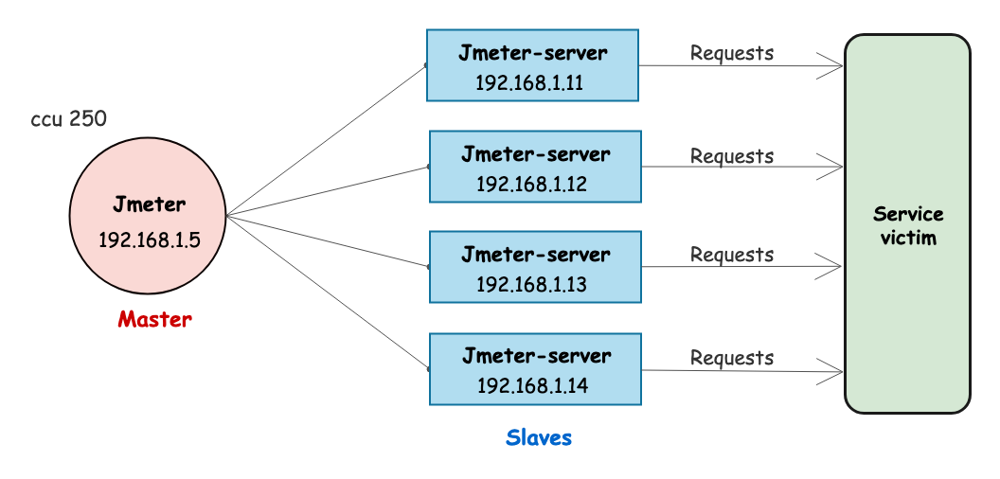
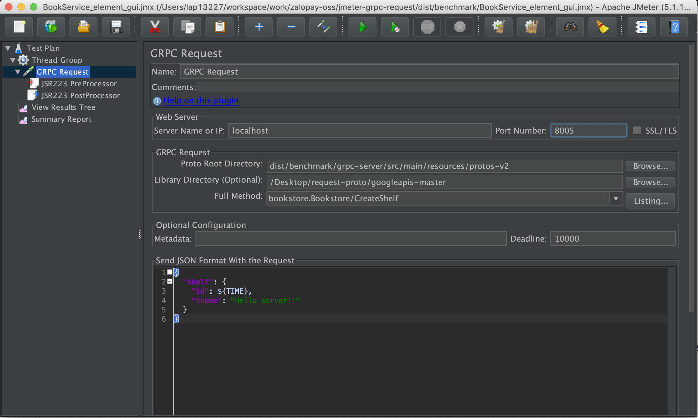
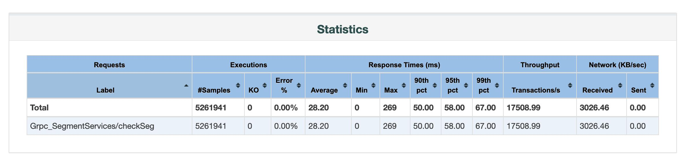
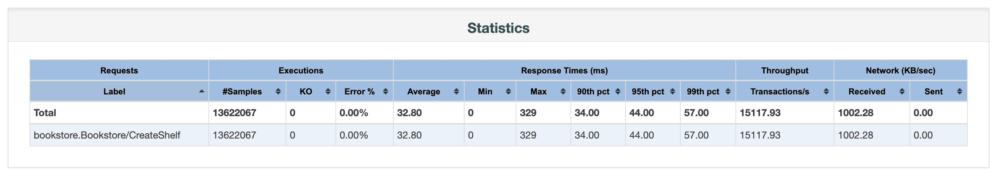
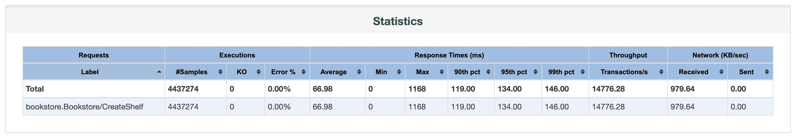

# Benchmark: jmter-grpc-request

## 1. Purpose

Verify that *jmeter-grpc-request* is really stable when performing load testing for the gRPC system. To do this, create a simple gRPC server then use JMeter with *jmter-grpc-request* sampler to load test with multiple test cases.

## 2. Prepare materials

### Load test model



Apply JMeter's distributed testing model running in non-GUI mode. Using 4 servers to load test, configure each server as follows:

- OS: CentOS Linux
- Mem: 32G
- Swap: 4.0G
- CPU: Intel(R) Xeon(R) 8 core

### Creating the gRPC server 

Proto file information:

1. shelf.proto

```java
syntax = "proto3";

package bookstore;

option java_outer_classname = "ShelfProto";
option java_package = "generated.com.google.endpoints.examples.bookstore";

// A shelf resource.
message Shelf {
  // A unique shelf id.
  int64 id = 1;
  // A theme of the shelf (fiction, poetry, etc).
  string theme = 2;
}
```

2. http_bookstore.proto

```java
syntax = "proto3";

package bookstore;

option java_multiple_files = true;
option java_outer_classname = "BookstoreProto";
option java_package = "generated.com.google.endpoints.examples.bookstore";

import "google/api/annotations.proto";
import "google/protobuf/empty.proto";
import "shelf.proto";

// A simple Bookstore API.
//
// The API manages shelves and books resources. Shelves contain books.
service Bookstore {
  // Returns a list of all shelves in the bookstore.
  rpc ListShelves (google.protobuf.Empty) returns (ListShelvesResponse) {
    // Define HTTP mapping.
    // Client example (Assuming your service is hosted at the given 'DOMAIN_NAME'):
    //   curl http://DOMAIN_NAME/v1/shelves
    option (google.api.http) = { get: "/v1/shelves" };
  }
  // Creates a new shelf in the bookstore.
  rpc CreateShelf (CreateShelfRequest) returns (Shelf) {
    // Client example:
    //   curl -d '{"theme":"Music"}' http://DOMAIN_NAME/v1/shelves
    option (google.api.http) = {
      post: "/v1/shelves"
      body: "shelf"
    };
  }
}

// Response to ListShelves call.
message ListShelvesResponse {
  // Shelves in the bookstore.
  repeated Shelf shelves = 1;
}

// Request message for CreateShelf method.
message CreateShelfRequest {
  // The shelf resource to create.
  Shelf shelf = 1;
}
```

The code override for the gRPC server:

```java
private static class BookstoreServicesImpl extends BookstoreGrpc.BookstoreImplBase {

    @Override
    public void createShelf(CreateShelfRequest request, StreamObserver<Shelf> responseObserver) {
      String messageServer = "SERVER";

      try {
        String theme = request.getShelf().getTheme();
        long id = request.getShelf().getId();

        Shelf shelf = Shelf.newBuilder()
            .setId(id)
            .setTheme(theme + "_" + new Random().nextInt(10000) + "_" + messageServer)
            .build();

        logger.info(request.toString());
        responseObserver.onNext(shelf);
        responseObserver.onCompleted();

      } catch (Exception e) {
        logger.info(e.getMessage());
      }

    }
  }
```

Deploy information:

- Call via IP, port.
- Only 1 instance, run with command `java -cp "./gprc-server-1.0-SNAPSHOT.jar" server.BookStoreServer`.
- Very simple, no gateway no load balance.

## 3. Execute load test



Execute JMeter in non-GUI mode and combine with *jmter-grpc-request* sampler. With test script here [BookService_element_gui.jmx](./BookService_element_gui.jmx).

## 4. Reports

With test cases as below.

### ## 1st result:

- CCU: 500 user
- Duration: 5 min



### ## 2nd result:

- CCU: 500 user
- Duration: 15 min



### ## 3rd result:

- CCU: 1000 user
- Duration: 5 min



### ## 4th result:

- CCU: 120 user
- Duration: 30 min


### ## 5th result:

- CCU: 120 user
- Duration: 60 min

